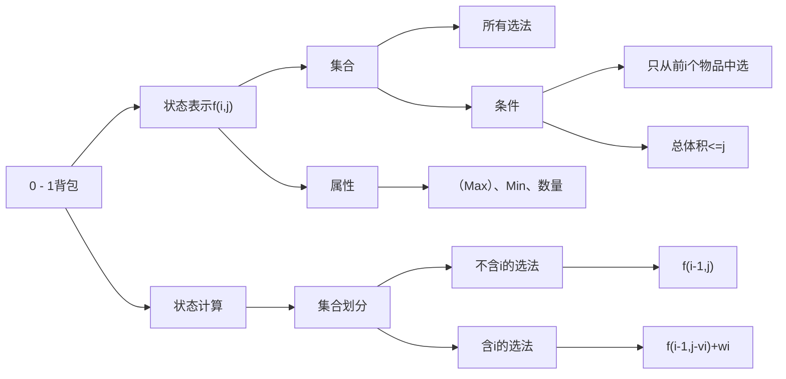
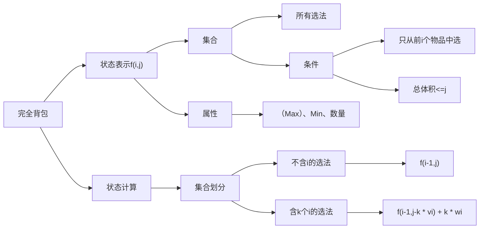
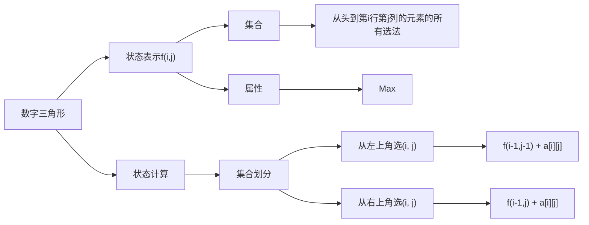

> 背包体积 $V$ , 物品数量 $N$ , 每个物品的体积为 $v_i$ ,  价值为 $w_i$ 

# 0 - 1背包
每个物品最多选择一次  
求背包最多能装价值为多少的物品

## 朴素算法
```C++
int d[N][N];
for (int i = 1; i <= N; i ++ )
{
    for (int j = 1; j <= V; j ++)
    {
        d[i][j] = d[i - 1][j];
        if (j >= v[i])
            d[i][j] = max(d[i][j], d[i - 1][j - v[i]] + w[i]);
    }
}
```

## 一维优化
二维情况下，第一维分量 $i$ 只用到了 $i-1$ ，即 $f(i, ) = f(i - 1, )$  
故可以用滚动数组，将分量 $i$ 删除，  
第一次 $d(i ,j) = d(i-1, j)$ 删除后变为 $d(j) = d(j)$  
则此语句可以删除  
第二次 $d(i, j) = max(d(i,j), d(i-1,j-v_i) + w_i$ 删除后变为 $d(j) = max(d(j), d(j - v_i) + w_i)$  
而为了让 $d(j - v_i)$ 在 $d(j)$ 之前更新，亦即满足 $d(j - v_i)$ 是在 $i - 1$ 时的值，需要改变遍历顺序，变为从后往前，并且判断条件 $j >= v[i]$ 可以直接加入 $for$ 循环中，具体代码如下
```C++
int f[N];
for (int i = 1; i <= N; i ++)
{
    for (int j = V; j >= v[i]; j --)
        d[j] = max(d[j], d[j - v[i]] + w[i]);
}
```
# 完全背包
每个物品有无限个  

## 朴素算法
完全由基础的状态计算 $f(i, j) = max(f(i - 1, j - k * v_i) + k * w_i$ 而来，有三重循环
```C++
for (int i = 1; i <= N; i ++)
    for (int j = 1; j <= V; j ++)
        for (int k = 0; k <= j / v[i]; k ++)
            f[i][j] = max(f[i][j], f[i - 1][j - k * v[i]] + k * w[i]);
```
## 二维优化
$f(i,j) = max(f(i-1,j) , f(i-1,j - v_i) + w_i,f(i-1, j - 2*v_i) + 2 * w_i ....)$  
$f(i,j-v_i) = max(f(i-1,j-v_i), f(i-1, j - 2 * v_i) + w_i, ......)$  
可以发现 $f(i,j-v_i)$ 与 $f(i,j)$ 第二项往后所有项，只差一个常数 $w_i$ ，故状态计算式可改为  
$f(i,j) = max(f(i-1,j), f(i,j-v_i)+w_i)$  
不用第三重循环
```C++
for (int i = 1; i <= N; i ++)
    for (int j = 1; j <= V; j ++)
    {
        f[i][j] = f[i - 1][j];
        if (j >= v[i])
            f[i][j] = max(f[i][j], f[i][j - v[i]] + w[i]);
    }
```
## 一维优化
与0 - 1背包问题类似，状态计算式 $f(i,j) = max(f(i-1,j), f(i,j-v_i)+w_i)$ 第一个分量只用到了 $i$ 和 $i-1$ ，故可以考虑优化。最终计算式为
$f(j) = max(f(j), f(j - v_i) + w_i)$  
由于 $j-v_i$ 用到的就是第 $i$ 重循环时的值，故不需要更改循环方向
```C++
for (int i = 1; i <= N; i ++)
    for (int j = v[i]; j <= V; j ++)
        f[j] = max(f[j], f[j - v[i]] + w[i]);
```
# 多重背包
每个物品最多有 $s_i$ 个  
## 朴素算法
同完全背包，只是考虑第三重循环时，$k <= s[i]$  
状态计算式为 $f(i, j) = max(f(i - 1, j - k * v_i) + k * w_i$
> 时间复杂度为 $N * M * S$
```C++
for (int i = 1; i <= n; i ++ )
    for (int j = 1; j <= m; j ++)
        for (int k = 0; k <= s[i] && k <= j / v[i]; k ++)
            f[i][j] = max(f[i][j], f[i - 1][j - k * v[i]] + k * w[i]);
```
## 二进制优化
考虑一个数 $s$ ，可以用一个数列 $[1,2,4,8,16,....,2^k,c]$ 表示 $0-s$ 中任何一个数，数列中每一位数只有选与不选  

因此考虑将每一种物品按照数列进行打包，每个打包后的都视为新的物品，则多重背包问题就转换为0 - 1背包问题
> 物品数量的上限此时变为 $N * logS$  
> 时间复杂度为 $N * V * logS$
```C++
int v[N], w[N];
int f[V];

int cnt = 0;
for (int i = 1; i <= n; i ++)
{
    int a, b, s;
    cin >> a >> b >> s ;
    int k = 1;
    while (k <= s)
    {
        cnt ++;
        // 把k个物品i打包
        v[cnt] = a * k;
        w[cnt] = b * k;
        s -= k;
        k *= 2;
    }

    // 剩余的物品i一起打包
    if (s)
    {
        cnt ++;
        v[cnt] = s * a;
        w[cnt] = s * b;
    }
}
// 很重要，将物品总数从n替换为cnt
n = cnt;

for (int i = 1; i <= n; i ++)
    for (int j = V; j >= v[i]; j --)
        f[j] = max(f[j], f[j - v[i]] + w[i]);
``` 

# 分组背包
物品分成 $N$ 组，每组有若干个物品，一组只能选1个  
状态计算式为 $f(i, j) = max(f(i - 1, j - k * v_{ij}) + k * w_{ij}$  
```C++
// 假定已读入v[i][j],w[i][j]，表示第i组的第j个物品的体积和价值
for (int i = 1; i <= n; i ++)
    for (int j = m; j > 0; j --)
        for (int k = 0; k < s[i]; k ++)
            if (v[i][k] <= j)
                f[j] = max(f[j], f[j - v[i][k]] + w[i][k]);
```

# 线性Dp
## 数字三角形

```C++
int a[N][N];
int f[N][N];

// 初始化f，考虑到要取f[i - 1]，则从0开始，j要取到i + 1
for (int i = 0; i <= n; i ++ )
    for (int j = 0; j <= i + 1; j ++)
        f[i][j] = -INF;
f[1][1] = a[1][1];

// Dp主要部分
for (int i = 2; i <= n; i++)
    for (int j = 1; j <= i; j ++)
        f[i][j] = max(f[i - 1][j - 1] + a[i][j], f[i - 1][j] + a[i][j]);

// 从最后一行中找到最大值
int res = -INF;
for (int i = 1; i <= n; i ++)
    res = max(res, f[n][i]);

```