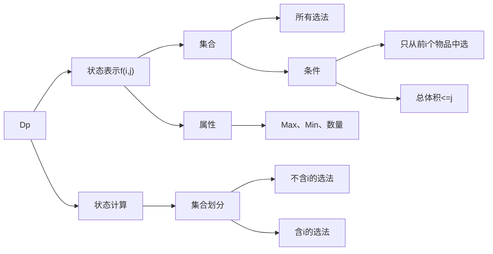

> 背包体积 $V$ , 物品数量 $N$ , 每个物品的体积为 $v_i$ ,  价值为 $w_i$ 

# 0 - 1背包
每个物品最多选择一次  
求背包最多能装价值为多少的物品

```mermaid
graph LR;
    A["Dp"]
    B["状态表示f(i,j)"]
    C["状态计算"]
    D[集合]
    E[属性]
    F[所有选法]
    G[条件]
    H[只从前i个物品中选]
    I["总体积<=j"]
    J["Max、Min、数量"]     
    K[集合划分]
    L["不含i的选法"]
    M["含i的选法"]
    A --> B
    A --> C
    B --> D
    B --> E
    D --> F
    D --> G
    G --> H
    G --> I
    E --> J
    C --> K
    K --> L
    K --> M
```

# 完全背包
每个物品有无限个  
# 多重背包
每个物品最多有 $s_i$ 个

## 优化

# 分组优化
物品分成 $N$ 组，每组有若干个物品，一组只能选1个