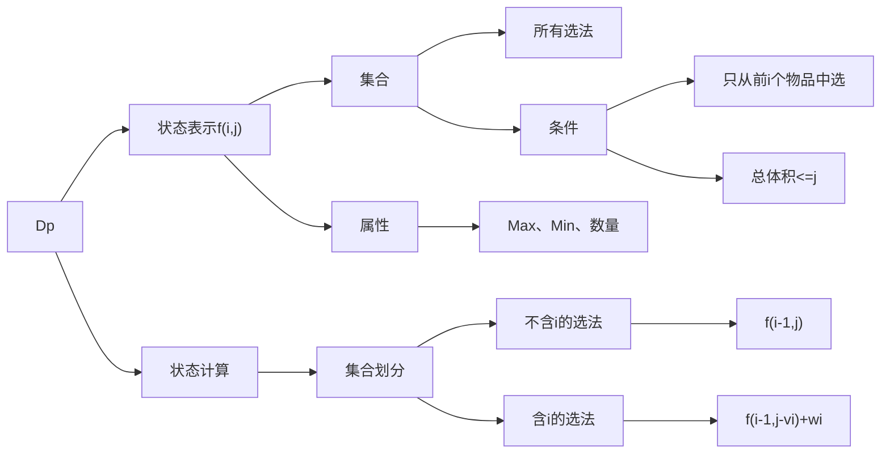

> 背包体积 $V$ , 物品数量 $N$ , 每个物品的体积为 $v_i$ ,  价值为 $w_i$ 

# 0 - 1背包
每个物品最多选择一次  
求背包最多能装价值为多少的物品

## 二维情况
```C++
int d[N][N];
for (int i = 1; i <= N; i ++ )
{
    for (int j = 1; j <= V; j ++)
    {
        d[i][j] = d[i - 1][j];
        if (j >= v[i])
            d[i][j] = max(d[i][j], d[i - 1][j - v[i]] + w[i]);
    }
}
```

## 一维优化
二维情况下，第一维分量 $i$ 只用到了 $i-1$ ，即 $f[i] = f[i - 1]$  
故可以用滚动数组，将分量 $i$ 删除，  
第一次 $d[i][j] = d[i - 1][j]$ 删除后变为 $d[j] = d[j]$  
则此语句可以删除  
第二次 $d[i][j] = max(d[i][j], d[i - 1][j - v[i]] + w[i]$ 删除后变为 $d[j] = max(d[j], d[j - v[i]] + w[i])$  
而为了让 $d[j - v[i]]$ 在 $d[j]$ 之前更新，亦即满足 $d[j - v[i]]$ 是在 $i - 1$ 时的值，需要改变遍历顺序，变为从后往前，并且判断条件 $j >= v[i]$ 可以直接加入 $for$ 循环中，具体代码如下
```C++
int f[N];
for (int i = 1; i <= N; i ++)
{
    for (int j = V; j >= v[i]; j --)
        d[j] = max(d[j], d[j - v[i]] + w[i]);
}
```
# 完全背包
每个物品有无限个  
# 多重背包
每个物品最多有 $s_i$ 个

## 优化

# 分组优化
物品分成 $N$ 组，每组有若干个物品，一组只能选1个