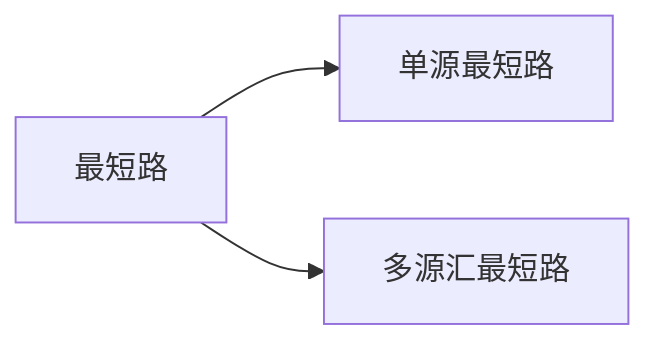

# BFS 与 DFS
||数据结构 |   空间 |   性质 |
|:--------:|:----------:|:------------:|:--------:|
|DFS|stack |  $O(h)$  |  不具最短性 |
|BFS|queue  | $O(2^h)$ | 最短路径 |

# 树和图的存储
树可以看作是无环联通图
图分为有向图和无向图，无向图可看作每条有向边存两次

## 有向图的存储
- 邻接矩阵
用一个$N*N$的矩阵存储每条边的信息
- 邻接表
每个节点用一个链表存储它指向的边
```C++
const int N = 100010, M = 2 * N;
int h[N], e[M], ne[M], idx;
memset(h, -1, sizeof h)

void add(int a, int b)      // a -> b连一条边
{
    e[idx] = b;
    ne[idx] = h[a];
    h[a] = idx ++; 
}
```

# 图的遍历
## DFS
```C++
int h[N], e[2 * N], ne[2 * N], idx;
bool st[N];

void dfs(int u)
{
    st[u] = true;
    for (int i = h[u]; i != -1; i = ne[i])
    {
        int j = e[i];
        if (!st[j])
            dfs(j);
    }
}
```
## BFS
```C++
int h[N], e[2 * N], ne[2 * N], idx;
int d[N];

int bfs()
{
    memset(d, -1, sizeof d);
    queue<int> q;
    d[1] = 0;
    q.push(1);
    while(q.size())
    {
        int k = q.front();
        q.pop();
        for (int i = h[k]; i != -1; i = ne[i])
        {
            int j = e[i];
            if (d[j] == -1)
            {
                q.push(j);
                d[j] = d[k] + 1;
            }
        }
    }
    return d[n];
}
```
# 拓扑排序
有向无环图一定存在拓扑序列
```C++
int h[N], e[N], ne[N], idx;
int q[N], d[N];             // d[N]存储结点的入度
// 判断有向图是否存在拓扑序列，每次出队只移动hh，最后留在队中的即为拓扑序列
bool toposort()
{
    int hh = 0, tt = -1;
    for (int i = 1; i <= n; i ++ )
        if (!d[i])
            q[++ tt] = i;
    while (hh <= tt)
    {
        int t = q[hh ++];
        for (int i = h[t]; i != -1; i = ne[i])
        {
            int j = e[i];
            if (--d[j] == 0)
                q[++ tt] = j;
        }
    }
    return tt == n - 1;         // 若tt == n - 1，则所有结点都入队过一次
}
```

# 最短路

# Dijkstra
## 朴素算法
> dist[1] = 0, dist[i] = +INF;

> for i : 1 ~ n
>   
> t <- 不在s当中，距离最近的点（dist最小的点）
>   
> s <- t
>   
> 用t更新其余点的距离（dist）

```C++
int g[N][N], d[N];
bool st[N];

int dijkstra()
{
    memset(d, 0x3f, sizeof d);
    d[1] = 0;
    for (int i = 0; i < n; i ++)                // 循环n-1次也可以
    {
        int t = -1;
        // 找到未确定最短路的点中距离最短的点
        for (int j = 1; j <= n; j ++ )         
            if (!st[j] && (t == -1 || d[t] > d[j]))
                t = j;
        // 更新由刚加入的点到其余点的距离，也可加入st的判断
        for (int j = 1; j <= n; j ++ )
            d[j] = min(d[j], d[t] + g[t][j]);
        st[t] = true;
    }
    // 判断是否存在最短路
    if (d[n] == 0x3f3f3f3f)
        return -1;
    else
        return d[n];
}
```