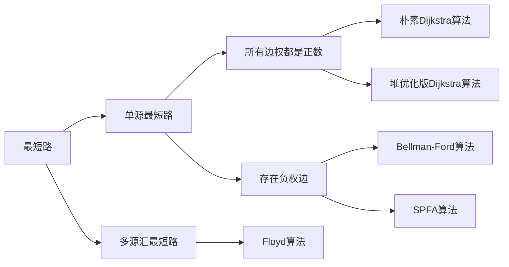

# BFS 与 DFS
|       | 数据结构 |   空间   |    性质    |
| :---: | :------: | :------: | :--------: |
|  DFS  |  stack   |  $O(h)$  | 不具最短性 |
|  BFS  |  queue   | $O(2^h)$ |  最短路径  |

# 树和图的存储
树可以看作是无环联通图
图分为有向图和无向图，无向图可看作每条有向边存两次

## 有向图的存储
- 邻接矩阵
用一个$N*N$的矩阵存储每条边的信息
- 邻接表
每个节点用一个链表存储它指向的边
```C++
const int N = 100010, M = 2 * N;
int h[N], e[M], ne[M], idx;
memset(h, -1, sizeof h)

void add(int a, int b)      // a -> b连一条边
{
    e[idx] = b;
    ne[idx] = h[a];
    h[a] = idx ++; 
}
```

# 图的遍历
## DFS
```C++
int h[N], e[2 * N], ne[2 * N], idx;
bool st[N];

void dfs(int u)
{
    st[u] = true;
    for (int i = h[u]; i != -1; i = ne[i])
    {
        int j = e[i];
        if (!st[j])
            dfs(j);
    }
}
```
## BFS
```C++
int h[N], e[2 * N], ne[2 * N], idx;
int d[N];

int bfs()
{
    memset(d, -1, sizeof d);
    queue<int> q;
    d[1] = 0;
    q.push(1);
    while(q.size())
    {
        int k = q.front();
        q.pop();
        for (int i = h[k]; i != -1; i = ne[i])
        {
            int j = e[i];
            if (d[j] == -1)
            {
                q.push(j);
                d[j] = d[k] + 1;
            }
        }
    }
    return d[n];
}
```
# 拓扑排序
有向无环图一定存在拓扑序列
```C++
int h[N], e[N], ne[N], idx;
int q[N], d[N];             // d[N]存储结点的入度
// 判断有向图是否存在拓扑序列，每次出队只移动hh，最后留在队中的即为拓扑序列
bool toposort()
{
    int hh = 0, tt = -1;
    for (int i = 1; i <= n; i ++ )
        if (!d[i])
            q[++ tt] = i;
    while (hh <= tt)
    {
        int t = q[hh ++];
        for (int i = h[t]; i != -1; i = ne[i])
        {
            int j = e[i];
            if (--d[j] == 0)
                q[++ tt] = j;
        }
    }
    return tt == n - 1;         // 若tt == n - 1，则所有结点都入队过一次
}
```

# 最短路

## Dijkstra
### 朴素算法
> dist[1] = 0, dist[i] = +INF;

> for i : 1 ~ n
>   
> t <- 不在s当中，距离最近的点（dist最小的点）
>   
> s <- t
>   
> 用t更新其余点的距离（dist）

```C++
int g[N][N], d[N];
bool st[N];

int dijkstra()
{
    memset(d, 0x3f, sizeof d);
    d[1] = 0;
    for (int i = 0; i < n; i ++)                // 循环n-1次也可以
    {
        int t = -1;
        // 找到未确定最短路的点中距离最短的点
        for (int j = 1; j <= n; j ++ )         
            if (!st[j] && (t == -1 || d[t] > d[j]))
                t = j;
        // 更新由刚加入的点到其余点的距离，也可加入st的判断
        for (int j = 1; j <= n; j ++ )
            d[j] = min(d[j], d[t] + g[t][j]);
        st[t] = true;
    }
    // 判断是否存在最短路
    if (d[n] == 0x3f3f3f3f)
        return -1;
    else
        return d[n];
}
```
### 堆优化版本
```C++
typedef pair<int, int> PII;
int h[N], e[N], ne[N], idx, w[N];
int d[N];
bool st[N];

int dijkstra()
{
    memset(d, 0x3f, sizeof d);
    d[1] = 0;
    priority_queue<PII, vector<PII>, greater<PII>> heap;    // 小根堆 
    heap.push({0, 1});
    while (heap.size())
    {
        auto t = heap.top();
        heap.pop();

        int ver = t.second;
        if (st[ver])
            continue;
        st[ver] = true;

        for (int i = h[ver]; i != -1; i = ne[i])
        {
            int j = e[i];
            if (d[j] > d[ver] + w[i])
            {
                d[j] = d[ver] + w[i];
                heap.push({d[j], j});
            }
        }
    }
    if (d[n] == 0x3f3f3f3f)
        return -1;
    else
        return d[n];
}
```

## Bellman-Ford算法
> for n次
>
>   备份
>   for 所有边a -- w --> b
> 
>   dist[b] = min(dist[b], backup[a] + w)
>
循环完成后，一定有$dist[b] <= dist[a] + w$

如果有负权回路，就没有最短路（每次经过回路路径都减少）

```C++
int d[N], backup[N];
struct Edge
{
    int a, b, w;
}edges[M];

void bellman_ford()
{
    memset(d, 0x3f, sizeof d);
    d[1] = 0;
    for (int i = 0; i < k; i ++)
    {
        memcpy(backup, d, sizeof d);
        for (int j = 0; j < m; j ++)
        {
            auto t = edges[j];
            d[t.b] = min(d[t.b], backup[t.a] + t.w);
        }
    }
}

// 判断
if (d[n] > 0x3f3f3f3f / 2)              // 存在负权边，故d[n]可能比0x3f3f3f3f小一点
    cout << "impossible" << endl;
else
    cout << d[n] << endl;
```

## SPFA算法
> 大部分正权图也可以用，超时就用dijkstra
优化Bellman-Ford算法，$dist[b] = min(dist[b], backup[a] + w)$, 只有dist[a]变小了，dist[b]才会变
```C++
int h[N], e[N], ne[N], w[N], idx;
int d[N];
bool st[N];

void spfa()
{
    queue<int> q;
    memset(d, 0x3f, sizeof d);
    d[1] = 0;
    q.push(1);
    st[1] = true;
    
    while (q.size())
    {
        int t = q.front();
        q.pop();
        st[t] = false;

        for (int i = h[t]; i != -1; i = ne[i])
        {
            int j = e[i];
            if (d[j] > d[t] + w[i])
            {
                d[j] = d[t] + w[i];
                if (!st[j])
                {
                    q.push(j);
                    st[j] = true;
                }
            }
        }
    }
}
```
求负权环时，可以用一个cnt[x]表示1~x的最短路的结点数，当某一次循环中cnt[x] >= n了，则存在负权环
```C++
int h[N], e[M], ne[M], w[M], idx;
int d[N], cnt[N];
bool st[N];

bool spfa()
{
    queue<int> q;
    for (int i = 1; i <= n; i ++)
    {
        q.push(i);
        st[i] = true;
    }

    while (q.size())
    {
        int t = q.front();
        q.pop();
        st[t] = false;
        for (int i = h[t]; i != -1; i = ne[i])
        {
            int j = e[i];
            if (d[j] > d[t] + w[i])
            {
                d[j] = d[t] + w[i];
                cnt[j] = cnt[t] + 1;
                if (cnt[j] >= n)            // 存在负环
                    return true;
                if (!st[j])
                {
                    st[j] = true;
                    q.push(j);
                }
            }
        }
    }
    return false;
}
```

## Floyd算法
d[i, j]: 邻接矩阵

基于动态规划, d[k, i, j]表示从i开始，经过1-k的结点，到j

d[k, i, j] = d[k - 1, i , k] + d[k - 1, k, j]
> 
> for k : 1 ~ n  
>   for i : 1 ~ n  
>      for j : 1 ~ n  
>         d[i, j] = min(d[i, j], d[i, k] + d[k, j])
>
```C++
// floyd函数
void floyd()
{
    for (int k = 1; k <= n; k ++)               // k必须第一层，ij可以互换
        for (int i = 1; i <= n; i ++)
            for (int j = 1; j <= n; j ++)
                d[i][j] = min(d[i][j], d[i][k] + d[k][j]);
}

// 初始化
for (int i = 1; i <= n; i ++)
    for (int j = 1; j <= n; j ++)
        if(i == j)  d[i][j] = 0;
        else        d[i][j] = INF;

// 判断
if (d[i][j] > INF / 2)              // 不存在
```